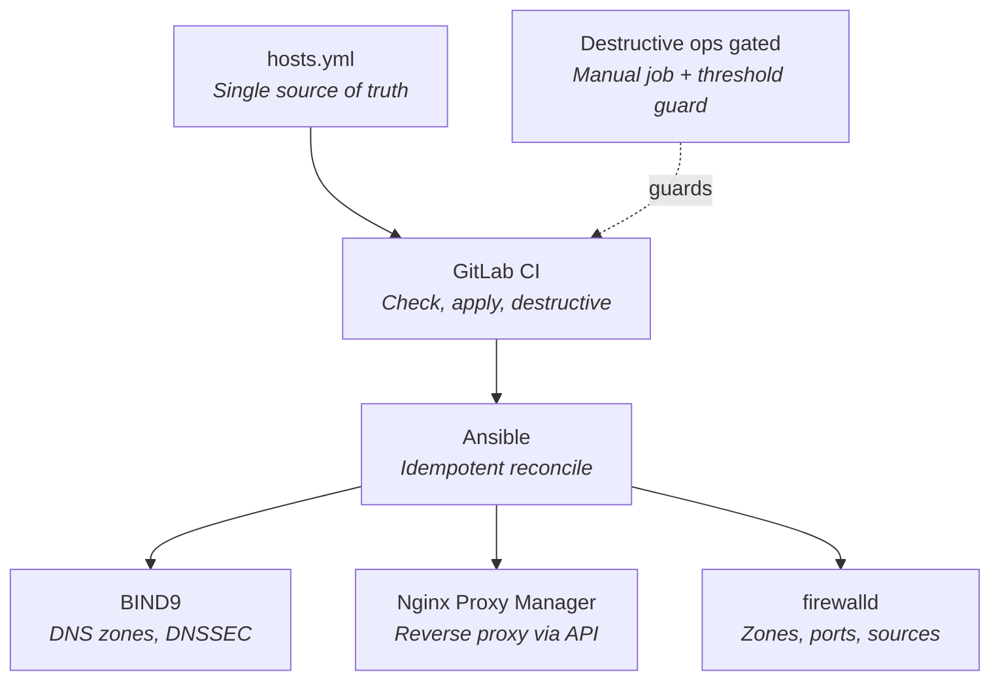

# homelab-dns-management

Git-driven DNS, reverse proxy, and firewall management for a homelab.
Edit one YAML file, push to Git, and a CI/CD pipeline reconciles BIND9
(with DNSSEC), Nginx Proxy Manager, and firewalld across multiple hosts
to match. Destructive operations are gated behind manual approval and
safety thresholds.

> **Note:** this is a sanitized mirror of a real system that has been
> running my homelab in production. Hostnames, IPs, and domain names
> have been generalized for public release; the workflow, playbooks,
> custom module, and recovery procedures are unchanged from what's
> running live.

## Architecture



`hosts.yml` is the single source of truth. A commit triggers GitLab CI,
which runs Ansible in `--check --diff` on branches and applies on merge
to `main`. Ansible reconciles three independent subsystems — BIND9,
Nginx Proxy Manager, and firewalld — using idempotent playbooks and a
custom module for the NPM REST API. Destructive operations (deleting
records, removing proxy entries, closing ports) are isolated into
separate manually-triggered jobs and guarded by deletion-count
thresholds.

## What this demonstrates

- GitOps workflow with diff-then-apply via GitLab CI
- Idempotent Ansible reconciliation across three subsystems
  (BIND9, Nginx Proxy Manager, firewalld)
- Custom Ansible module for NPM REST API (`library/npm_proxy.py`)
- DNSSEC-aware record management with `inline-signing`
- Real-world recovery procedures for production-style failure modes
- Defensive design: destructive operations are opt-in, threshold-guarded,
  and reversible

## Workflow

1. Edit `hosts.yml` — add / change / remove an entry
2. Commit to a branch and push
3. Pipeline runs `--check --diff` automatically, shows you what would change
4. If the diff looks right, merge to main
5. Pipeline applies the change: zone file regenerates, `rndc reload` fires

## DNS reconciliation

Both `homelab.example.com` (managed) and `secondary.example.com` (unmanaged,
dormant). Runs against `primary-dns` (10.0.0.19) which is the primary
BIND. `watchdog-pi` (10.0.0.2) picks up changes via standard BIND AXFR
zone transfer, configured at the BIND server level.

## Reverse proxy reconciliation

NPM (Nginx Proxy Manager) reconciliation against the instance at
`10.0.0.19:81`. Entries in `hosts.yml` under `proxies:` are created or
updated to match; deletes are opt-in via a flag. The second NPM
(`10.0.0.2`) is intentionally out of scope.

## Firewall port reconciliation

firewalld port reconciliation on primary-dns. Entries in `hosts.yml`
under each zone's `tcp` / `udp` lists are opened in the specified zone;
closing ports currently open but missing from the list is opt-in via a
flag, and guardrailed the same way as NPM destructive runs.

## Layout

```
.
├── ansible.cfg                      # repo-local ansible config
├── inventory.ini                    # target hosts
├── hosts.yml                        # the source of truth
├── group_vars/all/vars.yml          # paths, commands
├── library/npm_proxy.py             # custom module: NPM CRUD for one entry
├── playbooks/reconcile.yml          # DNS reconcile
├── playbooks/reconcile-npm.yml      # NPM reconcile
├── playbooks/reconcile-fw.yml       # firewalld reconcile
├── playbooks/fw-export.yml          # one-shot port dump for hosts.yml
├── playbooks/fw-audit.yml           # full firewalld state audit (read-only)
├── templates/zone.db.j2             # BIND zone template
└── .gitlab-ci.yml                   # check on branches, apply on main
```

## Manual run (from the runner container or a workstation with SSH access)

In production this runs through GitLab CI on push and merge; the manual
commands below are for testing on a workstation.

```bash
# Dry run — shows unified diff, makes no changes
ansible-playbook playbooks/reconcile.yml --check --diff

# Apply
ansible-playbook playbooks/reconcile.yml
```

## Rollback

Zone files are backed up to `{name}.db.bak` before every write:

```bash
docker exec bind9 bash -c 'cp /var/lib/bind/homelab.example.com.db.bak /var/lib/bind/homelab.example.com.db && rndc reload homelab.example.com'
```

Then fix `hosts.yml`, commit, push to restore via Git.

## Adding new records

### CNAME pointing at primary-dns (most common)

```yaml
cnames:
  - { name: newservice, target: "@" }
```

### CNAME pointing at ns2 / Pi

```yaml
cnames:
  - { name: newservice, target: ns2 }
```

### A record with dedicated IP

```yaml
a_records:
  - { name: newhost, ip: 10.0.0.xxx }
```

### Per-record TTL override (optional)

Both `a_records` and `cnames` accept an optional `ttl:` field that overrides the
zone-wide `$TTL`. Use it when you need faster propagation on a single record —
most commonly, in the day before a removal so external resolvers drop the cached
entry quickly after the delete lands.

```yaml
a_records:
  - { name: oldhost, ip: 10.0.0.50, ttl: 300 }   # 5 min, instead of 24 h

cnames:
  - { name: oldservice, target: "@", ttl: 300 }
```

Nameserver glue A records deliberately do not take a TTL override — NS TTL
changes interact with the parent DS record and are not part of this workflow.

## Removing a record (DNSSEC-aware)

BIND's `inline-signing` handles the DNSSEC side automatically: when a record is
deleted, the RRSIG for it is dropped, the NSEC/NSEC3 chain is regenerated, and
the zone is re-signed. Nothing manual required.

External caching is the only wrinkle. With `$TTL 86400`, resolvers may hand out
the deleted record for up to 24 h. For internal-only records that's usually
fine. When it isn't:

1. Day 0: add `ttl: 300` to the record in `hosts.yml`, commit, merge.
2. Wait for the previous TTL to expire in the wild (up to 24 h).
3. Day 1: delete the record from `hosts.yml`, commit, merge. Caches clear in
   ~5 minutes instead of a day.

## Managing NPM proxies

### Credentials

Credentials live **only** in GitLab CI/CD variables — not in a vault file,
not in a local shell, not anywhere on disk. Add them once under
`Settings > CI/CD > Variables` (mark both masked and protected):

- `NPM_EMAIL`
- `NPM_PASSWORD`

Reconciles run through the pipeline; there is no expected path for running
this playbook from a workstation.

### Adding a proxy entry

Append to `proxies:` in `hosts.yml`. Simple case:

```yaml
proxies:
  - domain: audiobookshelf.homelab.example.com
    npm_target: npm_primary
    forward_host: 10.0.0.19
    forward_port: 8000
```

Core optional fields (with defaults): `forward_scheme: http`,
`certificate_id: 1`, `ssl_forced: true`, `allow_websocket_upgrade: true`.

For per-host tweaks (Proxmox nodes, anything with a self-signed backend, etc.),
add any of the following and they become source-of-truth for that entry —
`hosts.yml` wins over the NPM UI. Omit them and the UI value is preserved.

- `advanced_config` — raw nginx directives
- `http2_support`, `hsts_enabled`, `hsts_subdomains`
- `block_exploits`, `caching_enabled`
- `access_list_id`

Example for a Proxmox node:

```yaml
- domain: pve1.homelab.example.com
  npm_target: npm_primary
  forward_host: 10.0.0.50
  forward_port: 8006
  forward_scheme: https
  advanced_config: |
    proxy_ssl_verify off;
    proxy_redirect off;
    proxy_http_version 1.1;
```

### Running

NPM reconciliation runs through the pipeline, same Git flow as DNS:

| Action                                                    | How                                                                                 |
| --------------------------------------------------------- | ----------------------------------------------------------------------------------- |
| Dry run (diff of what would change)                       | Push to any non-main branch or open an MR → `npm-check` runs automatically          |
| Apply (create / update only)                              | Merge to `main` → `npm-apply` runs automatically                                    |
| Destructive sweep (delete NPM entries not in `hosts.yml`) | Merge to `main`, then manually trigger the `npm-destructive` job from the GitLab UI |

A non-destructive `npm-apply` still reports extras — entries that exist in
NPM but not in `hosts.yml` — in the job log, without touching them. Review
the list before promoting to `npm-destructive`.

### What is (and isn't) managed

Two tiers:

- **Core — always written.** `domain_names`, `forward_host`, `forward_port`,
  `forward_scheme`, `certificate_id`, `ssl_forced`, `allow_websocket_upgrade`.
  Every reconcile settles these to whatever `hosts.yml` says.

- **Optional — written only when listed in `hosts.yml`.** `advanced_config`,
  `http2_support`, `hsts_enabled`, `hsts_subdomains`, `block_exploits`,
  `caching_enabled`, `access_list_id`. If an entry in `hosts.yml` mentions
  one of these, `hosts.yml` wins. If it doesn't, the current NPM value is
  preserved across reconciles — so UI tweaks survive unless you
  deliberately pull them into Git.

- **Never managed.** `locations`, `meta`, and anything NPM auto-computes.
  Always preserved from the existing entry on update.

Bootstrap the `proxies:` block from live NPM state with
`scripts/npm-export.py` — the first pass emits the minimal entries and
adds optional fields only when they already differ from NPM defaults,
so hand-tweaked entries like Proxmox nodes come out of the export
correctly declared.

### Rollback

NPM has no built-in versioning. If a change lands that shouldn't have: revert
the commit in `hosts.yml`, push, and the next reconcile writes the prior
state back. For deletes made with `destructive=true`, the entry is gone from
NPM — you'd need to recreate it by re-adding to `hosts.yml` and running
again.

### Destructive safety guardrails

`destructive=true` is guarded in the playbook. It will refuse to run when:

- `proxies:` is empty (would delete every NPM entry), OR
- more than `destructive_max_deletes` (default 5) entries would be removed
  in a single run.

If a large cleanup really is intended (first bulk import, decommission,
etc.), override with `-e force=true`. The default threshold exists because
an unguarded destructive run once deleted every NPM entry when `proxies:`
was still empty.

## Recovery: "every site shows ERR_SSL_UNRECOGNIZED_NAME_ALERT"

Symptom: every proxied domain returns `ERR_SSL_UNRECOGNIZED_NAME_ALERT` at
the TLS handshake. NPM admin UI at `http://10.0.0.19:81` still works and
lists the proxy hosts, *or* lists none at all.

Root cause: NPM's proxy hosts have been deleted via the API (either by
this playbook with `destructive=true`, or manually through the UI).
Deletes remove the per-host `/data/nginx/proxy_host/<id>.conf` files, so
nginx has no server blocks and rejects every SNI.

NPM uses soft deletes — the DB rows still exist with `is_deleted = 1`.
Recovery is a two-step process:

**Step 1 — restore the DB rows** (SSH to primary-dns):

```bash
cd ~/nginx-proxy-manager
sudo cp volumes/nginx_proxy_manager/data/database.sqlite volumes/nginx_proxy_manager/data/database.sqlite.before-recovery

# Confirm the count of recent soft deletes. Adjust the timestamp to the
# window of the mistaken deletion.
sudo sqlite3 volumes/nginx_proxy_manager/data/database.sqlite \
  "SELECT COUNT(*) FROM proxy_host WHERE is_deleted = 1 AND modified_on >= 'YYYY-MM-DD HH:MM:SS';"

# If that count matches what you expect to restore, flip the flag and
# restart NPM.
sudo docker compose stop
sudo sqlite3 volumes/nginx_proxy_manager/data/database.sqlite \
  "UPDATE proxy_host SET is_deleted = 0 WHERE is_deleted = 1 AND modified_on >= 'YYYY-MM-DD HH:MM:SS';"
sudo docker compose up -d
```

**Step 2 — regenerate nginx config files.** The DB restore brings rows
back but does not recreate the `/data/nginx/proxy_host/*.conf` files.
NPM only writes those on create/update API calls. Run the regen script
from this repo:

```bash
python3 scripts/npm-regen.py
```

It prompts for NPM admin credentials, then PUTs every live proxy host
back to its current state, which triggers NPM to rewrite each nginx
config and reload. After ~45 seconds the proxies serve traffic again.

## Managing firewall ports

firewalld on primary-dns is reconciled against `hosts.yml`. One entry
per target host, keyed under `firewall:`, with a dict of zones. Each
zone has its own `sources`, `services`, `tcp`, and `udp` lists. Zones
not listed here (including the default `public`, `trusted`, `docker`)
are left alone.

```yaml
firewall:
  primary-dns:
    zones:
      trusted-base:
        sources: [10.99.0.0/16]
        services: [mountd, ntp, rpc-bind, samba, ssh]
        tcp: [53, 80, 81, 443, ...]
        udp: [53, 1161, ...]
      trusted-lan:
        sources:
          - 10.0.0.0/24
          - 10.0.1.0/24
          - 10.0.2.0/24
          - 10.0.3.0/24
        services: [mountd, ntp, rpc-bind, samba, ssh]
        tcp: [...]
        udp: [...]
```

A firewalld source can be bound to exactly one zone at a time.
Changing a CIDR's zone here will unbind it from wherever it was
previously — expected during the initial migration, noise-making
otherwise. The playbook reflects this: adds are always safe; source
changes move traffic between zones the moment they apply.

### Understanding what is currently configured

If the firewall is already complicated — lots of rich rules, forward
ports, multiple active zones — start with a read-only audit that dumps
everything:

```bash
ansible-playbook playbooks/fw-audit.yml
```

Or trigger the `fw-audit` manual job from the GitLab UI. Output includes
every active zone's services, ports, forward-ports, masquerade status,
and a **numbered list of rich rules per zone** so you can reference rule
`[7]` in conversation or commits.

Audit first, decide what's worth codifying, then bootstrap.

### Bootstrap current state

Once you know what's there, dump the port list for the zone you want
managed and paste it into `hosts.yml`:

```bash
ansible-playbook playbooks/fw-export.yml -e fw_target=primary-dns -e zone=public
```

The playbook prints a `firewall:` block ready to drop in.

Rich rules are **not** managed by the current playbook — only simple
ports. Anything complex (source-restricted rules, log+rate-limit rules)
stays in firewalld's own config and is visible via `fw-audit`.

### Running

| Action                                                                  | How                                                                       |
| ----------------------------------------------------------------------- | ------------------------------------------------------------------------- |
| Dry run (diff of what would change)                                     | Push to any non-main branch or open an MR → `fw-check` runs automatically |
| Apply (open missing ports, bind sources)                                | Merge to `main` → `fw-apply` runs automatically                           |
| Destructive close (remove services/ports/sources not in `hosts.yml`)    | Manually trigger `fw-destructive` from the GitLab UI on a main pipeline   |
| Read-only state dump (audit all zones, numbered rich rules)             | Manually trigger `fw-audit` from the GitLab UI                            |
| One-shot cleanup of old rich rules from `public` after a zone migration | Manually run `playbooks/fw-migrate.yml`                                   |

`fw-apply` opens listed ports but does not close anything. A
non-destructive run still reports extras in the job log, so you can see
drift without acting on it.

### Destructive safety guardrails

`fw-destructive` is guarded the same way as `npm-destructive`. It will
refuse to run when:

- both `tcp` and `udp` lists for the target are empty (would close
  every port in the zone), or
- more than `destructive_max_deletes` (default 5) ports would be closed
  in a single run.

Override the threshold for a single run by setting `FW_MAX_DELETES` as
a pipeline variable (e.g. `FW_MAX_DELETES=10`) in GitLab's "Run
pipeline" dialog. For a genuine full wipe, re-run with `-e force=true`
via the same variable-passing mechanism.

## Notes

- Serial number is Unix epoch — monotonic, no state management needed
- BIND's `inline-signing` re-signs the zone automatically on reload
- DNSSEC keys live at `/opt/storage/docker/bind9/volumes/cache/` on
  primary-dns — backed up separately to `/opt/backup/`
- NPM admin UI uses a self-signed cert; the playbook sets
  `validate_certs: false` for that reason
- `ansible.posix` collection is required for `reconcile-fw.yml`
  (firewalld module). CI installs it automatically in the preflight;
  for local runs install once with
  `ansible-galaxy collection install ansible.posix`
